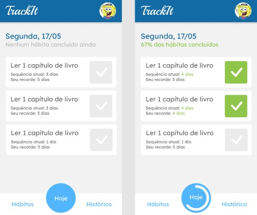

# Projeto - TrackIt

## Requisitos do projeto

- Tela Login (rota `/`)
    - [x]  Deve ser enviado o email e senha para a API conforme documentação
    - [x]  Enquanto estiver carregando, os campos e o botão devem ser desabilitados, conforme layout    
    - [x]  Em caso de sucesso, o usuário deve ser redirecionado para a rota `/hoje`
    - [x]  Em caso de falha, deve ser exibido um `alert` informando para o usuário e os campos/botão devem ser habilitados novamente
    - [x]  Ao clicar no link para se cadastrar, o usuário deve ser redirecionado para a rota `/cadastro`
  
- Tela Cadastro (rota `/cadastro`)
    - [x]  Os dados devem ser enviados para a API conforme documentação
    - [x]  Enquanto estiver carregando, os campos e o botão devem ser desabilitados, conforme layout
    - [x]  Em caso de sucesso, o usuário deve ser redirecionado para a rota `/` (rota de Login)
    - [x]  Em caso de falha, deve ser exibido um alert informando para o usuário e os campos/botão devem ser habilitados novamente
    - [x]  Ao clicar no link para logar, o usuário deve ser redirecionado para a rota `/` (rota de Login)
  
- Topo e Menu
    - [x]  Topo e menu devem ter posicionamento fixo
    - [x]  No topo deve ser exibida a foto do usuário conforme layout
    - [x]  No menu, os 3 botões de Hábitos, Hoje e Histórico devem redirecionar o usuário para as rotas `/habitos`, `/hoje` e `/historico` respectivamente
    - [x]  O botão de Hoje deve exibir uma barra de progresso circular indicando a porcentagem de conclusão de hábitos de hoje do usuário
   
- Tela Hábitos (rota `/habitos`)
    - [x]  Carregar os hábitos do usuário, mandando request pra API conforme documentação e exibindo abaixo conforme layout
    - [x]  Ao clicar para deletar um hábito, deve ser exibido um `confirm` para confirmar se o usuário gostaria realmente de apagar o hábito. Se sim, deve ser enviado um request pra API conforme documentação e os hábitos recarregados logo em seguida.
    - [x]  Caso o usuário não tenha nenhum hábito cadastrado, deve ser exibido o texto conforme layout
    - [x]  Ao clicar no botão de "+", deve-se exibir um formulário de cadastro de hábito logo abaixo do título conforme layout
    - [x]  O usuário deve inserir o nome do hábito em um campo de texto e selecionar os dias da semana que deseja realizar o hábito conforme layout
    - [x]  Ao salvar, devem ser enviados os dados para API conforme documentação
    - [x]  Enquanto estiver carregando, o campo de texto e o botão devem ser desabilitados, conforme layout. Os botões dos dias da semana devem ser desabilitados, porém não é necessária mudança visual durante o loading.
    - [x]  Em caso de sucesso, os campos devem ser limpos e reabilitados, o formulário deve ser escondido novamente e a lista de hábitos abaixo recarregada
    - [x]  Em caso de erro, os campos devem ser reabilitados e um alerta deve indicar o problema para o usuário
    - [x]  Ao Cancelar, o formulário deve ser escondido. Caso tenha dados já preenchidos, os mesmos devem ser mantidos caso o usuário reabra o formulário de criação.
  
- Tela Hoje (rota `/hoje`)
    - [x]  Carregar os hábitos de hoje do usuário, mandando request pra API conforme documentação e exibindo abaixo conforme layout
    - [x]  O título da tela deve exibir o dia de hoje conforme layout
    - [x]  No subtítulo deve ser exibida a frase "Nenhum hábito concluído ainda" ou "x% dos hábitos concluídos", dependendo do progresso do usuário
    - [x]  Ao marcar ou desmarcar um hábito como concluído, deve ser enviado um request pra API conforme documentação. Não é necessário colocar loading.
    - [x]  Ao marcar um hábito como concluído, deve ser colocada em verde a contagem da sequência atual
    - [x]  Caso a sequência atual seja igual ao recorde do usuário, este também deve ser exibido em verde
  
- Tela Histórico (rota `/historico`)